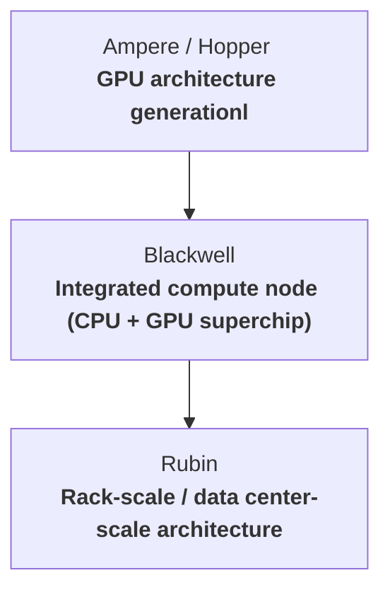

# Understanding the evolution of NVIDIA platforms

A platform is an integrated system comprising CPUs, GPUs, motherboards, power supply units, cooling systems, <b>[NVLink](https://www.nvidia.com/en-in/data-center/nvlink/)</b> switches, and other supporting infrastructure components.
Historically, NVIDIA’s platform development can be categorized into three distinct eras.

## Evolution of NVIDIA platform eras

### Frankenstien era:
In this phase, NVIDIA designed the GPUs, but the broader system stack remained externally integrated. CPUs were primarily sourced from Intel (Xeon) or AMD (EPYC), while server infrastructure, cooling systems, and system integration were handled by OEMs such as Dell, HPE, and Supermicro. NVIDIA did not yet control the full platform stack.
The CPU and GPU were separate devices with independent memory pools and coherency domains. Communication between them occurred over PCIe (Gen3/Gen4), which initially provided sufficient bandwidth for accelerator workloads.

However, as GPU performance scaled exponentially,particularly during the [**Volta**](https://www.nvidia.com/en-us/data-center/volta-gpu-architecture/) -> [**Ampere**](https://www.nvidia.com/en-in/data-center/ampere-architecture/) -> [**early Hopper**](https://www.nvidia.com/en-us/data-center/technologies/hopper-architecture/) generations the interconnect architecture began to show limitations.

To put the mismatch into perspective:
- PCIe Gen4 x16 bandwidth: ~32 GB/s
- A100 internal memory bandwidth: ~1.5 TB/s
- H100 internal memory bandwidth: ~3 TB/s

The growth curves of GPU compute and memory bandwidth far outpaced the incremental improvements in PCIe. Importantly, the bottleneck was not primarily CPU compute performance. Many AI workloads are GPU-bound. Instead, the critical constraints were:
- Host-device data movement bandwidth (I/O limitations)
- Memory separation between CPU and GPU
- Lack of full memory coherence

As AI workloads became increasingly data-intensive, PCIe bandwidth and latency, along with the host-device separation model, limited overall system efficiency.

### Transition era :
In this phase, NVIDIA began moving towards vertical integration by developing its own CPUs.This phase began with the introduction of the [Grace CPU](https://www.nvidia.com/en-in/data-center/grace-cpu/), NVIDIA’s Arm-based processor, which started the company’s move towards owning the CPU layer of the data center stack.

The first major milestone of this integration was [Grace Hopper (GH200)](https://www.nvidia.com/en-in/data-center/grace-hopper-superchip/), followed by the more advanced **Grace–Blackwell Superchip**. In these systems, the CPU and GPU are tightly integrated within a coherent module, connected via NVLink-C2C, a high-bandwidth, low-latency, cache-coherent interconnect.

This architecture fundamentally differs from the traditional discrete accelerator model:
- Traditional Model:  CPU ↔ PCIe ↔ GPU
- Grace-Based Model:  CPU ⇄ NVLink-C2C ⇄ GPU

The shift delivers a significant higher bandwidth also lowers the latency communication.Here we see cache-coherent memory sharing and a redunction in  host–device separation overhead.This dramatically improves efficiency for large-scale AI and data-intensive workloads.

However, while NVIDIA gained control over the CPU, GPU, interconnect, and system board architecture, it did not yet fully own the rack-level infrastructure. Physical rack components like the power delivery systems,cooling implementations were still largely manufactured and assembled by OEM and ODM partners such as Supermicro, Dell, and HPE. [Blackwell](https://www.nvidia.com/en-in/data-center/technologies/blackwell-architecture/)-based systems represent the maturation of this transition.

### Extreme Co-Design era:

In this phase, NVIDIA moves beyond partial vertical integration and enters what can be described as an extreme co-design model. The company is no longer designing only CPUs and GPUs it is architecting the entire rack-scale system as a unified compute platform.

NVIDIA now create:
- CPU architecture
- GPU architecture
- Interconnect fabric
- Networking topology
- Rack layout
- Power distribution design
- Cooling architecture
- System software stack

This dramatically reduces dependency on traditional OEM-led system assembly. While manufacturing and physical deployment may still involve partners, the architectural blueprint is NVIDIA-defined end-to-end.

A key development in this era is the introduction of next-generation components such as the Vera CPU and the Rubin GPU. These are not designed in isolation but they are engineered together as part of a tightly integrated rack-scale compute fabric.

They no longer optimized components independently because of this extrem co-design. Instead:
- The CPU is designed with GPU memory bandwidth requirements in mind.
- The GPU is designed around networking scale and rack-level power envelopes.
- The interconnect fabric is engineered to match AI workload communication patterns.
- Power and cooling systems are architected alongside silicon performance targets.

In this model, the rack itself behaves more like a single distributed supercomputer rather than a collection of discrete servers.
This represents a structural shift: NVIDIA transitions from being a chip vendor to operating as a full-stack AI infrastructure architect, where silicon, networking, thermals, power delivery, and software are co-optimized as one unified system.

### Conclusion :

# RUBIN - Latest NVIDIA Gem
## Major Breakthroughs :

### 6th Gen NVLink :
6th Generation NVLink is NVIDIA’s high-speed interconnect enabling direct GPU-to-GPU communication within a node and across systems.
With the Rubin architecture generation, NVLink significantly increases available bandwidth.

Provides up to **3.6 TB/s** aggregate bidirectional bandwidth per GPU across all NVLink connections.
This aggregate bandwidth is critical for minimizing communication bottlenecks in trillion-parameter scale models.

### Vera CPU :
Vera is NVIDIA’s custom ARM-based CPU designed specifically for AI infrastructure.

Key architectural points:
- Built using the ARM instruction set architecture [(ISA)](https://www.arm.com/glossary/isa)
- Implements NVIDIA’s own custom [“Olympus”](https://docs.nvidia.com/olympus-cpu-core-software-optimization-guide-dp12531-001v0-7.pdf) core design
- Not a lightly modified [Neoverse](https://www.arm.com/products/silicon-ip-cpu/neoverse/neoverse-n1) core as companies generally do , this is a ground-up NVIDIA microarchitecture

It is designed to work closely with NVLink-C2C (chip-to-chip interconnect), enabling coherent CPU–GPU memory access and reducing data transfer latency between compute domains.

### Rubin GPU:
The Rubin GPU is NVIDIA’s next-generation AI accelerator optimized for extreme-scale training and inference.

Rubin delivers up to:
- ~50 PFLOPS of AI tensor compute performance using [NVFP4](https://developer.nvidia.com/blog/introducing-nvfp4-for-efficient-and-accurate-low-precision-inference/) precision.

#### Precision & Transformer Engine:

Rubin integrates a next-generation Transformer Engine capable of dynamically switching between precision formats based on workload sensitivity:
- NVFP4 → Maximum throughput, lower precision, error-tolerant workloads
- FP8 → Balanced precision and performance
- FP16 → Higher precision for numerically sensitive operations

Adaptive precision switching maximizes computational efficiency by dynamically adjusting numerical precision based on workload requirements, reduces power consumption by using lower precision where full accuracy is unnecessary, maintains numerical stability through intelligent scaling and precision control, and accelerates large-scale AI training by optimizing resource utilization without compromising model performance.

### 3rd Gen Confidential Computing :
Data typically exists in three fundamental states:
- At Rest — Stored on persistent media such as hard drives or SSDs. This state is protected using disk encryption.
- In Transit — When data us moving across networks. Protection is provided by cryptographic protocols such as SSL/TLS (e.g., HTTPS).
- In Use — Actively processed by CPUs or GPUs. Historically, this has been the most vulnerable state because data must be decrypted in system memory to perform computation, potentially exposing it to privileged software such as the operating system, hypervisor, or system administrators.

Traditional systems therefore exhibit a critical security gap - data is protected while stored and transmitted, but not while being processed.

To address this, modern processors implement Trusted Execution Environments [(TEEs)](https://the-scarlet-thread.medium.com/how-trusted-execution-environments-tees-on-nvidia-h100-gpus-secure-ai-without-sacrificing-21b7218c7d17) — a typical vault that isolates , encrypts and stores sensitive code and data from the rest of the system. Here computation can occur without exposing plaintext data to external software, even at high privilege levels.

Evolution of Confidential Computing in Accelerated Systems
- 1st Gen : Early GPU security mechanisms focused on establishing a hardware root of trust rather than full workload isolation. Capabilities included secure boot, firmware authentication, and memory encryption. These features appeared in architectures such as NVIDIA Ampere, while earlier architectures like NVIDIA Volta lacked modern confidential computing capabilities.

- 2nd Gen : The next phase introduced true confidential computing support for GPUs, found in NVIDIA Hopper H100. Key capabilities include GPU operation within CPU confidential virtual machines encrypted PCIe communication, and strong isolation from host software.
In this model, an entire GPU could function as a trusted execution domain, but this was only securely functional for a single GPU.

- 3rd Gen : As discussed earlier, 2nd GEN technology was designed for a single GPU. When data moved from one GPU to another, it had to be decrypted before being transmitted, temporarily exposing . Modern architectures address this limitation by integrating inline hardware encryption directly into the interconnect fabric (NVLink switches). This enables secure communication without exposing plaintext data during transfer.As a result, rack-scale security is achieved. Multiple GPUs, CPUs, and switches can exchange data within a continuously protected domain without leaving the encrypted state. Additionally, cryptographic keys are frequently rotated to maintain a high level of security.

### 2nd GEN RAS Engine :

RAS (Reliability, Availability, Serviceability) is designed to detect faults, contain failures, and maintain continuous operation with minimal or no disruption.
In large training deployments involving thousands of accelerators running for weeks or months traditional maintenance approaches like pausing workloads for checks and repairs are economically and operationally infeasible. Even brief interruptions can waste significant compute time and inur generational loss. But modern systems has emphasized continuous health monitoring and rapid fault containment while workloads remain active.

Evolution of RAS :
- 1st Generation : Platforms based on NVIDIA Hopper H100 introduced systems that could detect and sometimes isolate faults, but often required software intervention or workload disruption.

- 2nd Generation : Next-generation platforms built on NVIDIA Blackwell and extended in NVIDIA Rubin significantly advance RAS capabilities toward autonomous operation.
Key characteristics include continuous health monitoring without pausing workloads, leveraging sideband telemetry that does not interfere with compute data paths. The system observes thousands of hardware signals—such as voltage, temperature, memory bit flops , signal integrity without the involevemnt of GPUs computation. Rather than relying solely on post-failure handling, these systems predicts faults and prepare accordingly before they esclate into critical situations.But this is more of a rapid containment than full predictive prevention.

## Flagship Model :

**VERA RUBIN NVL72**

This model includes :
- 36 VERA CPUs
- 72 RUBIN GPUs
- 9 NVLink Switches

Note -> eflops / exaflops : Earth floating point operations (1018)

Peformace :
- 3.6 exaFlops for Inference
- 2.5 exaFlops for Training
- 20.7 TB of [HBM4](https://www.supermicro.com/en/glossary/hbm4) Capacity
- 1.6 PB/s HBM4 Bandwidth
- 260 TB/s Scale up Bandwidth (data transfer between GPUs)
- 54 TB [LPDDR5X](https://in.micron.com/products/memory/dram-components/lpddr5x) (System RAM - CPU)

## Six New Chips in one AI Supercomputer :

- NVIDIA Vera CPU: 88 NVIDIA custom-designed Olympus cores with full Arm-compatibility.
- NVIDIA Rubin GPU: High-performance AI compute with HBM4 and new NVIDIA Transformer Engine.
- NVIDIA NVLink 6 switch: Sixth-generation scale-up fabric delivering 3.6 TB/s GPU-to-GPU bandwidth.
- NVIDIA ConnectX-9: High-throughput, low-latency networking interface (Network card). This is how users communicate with these platforms.
 - NVIDIA BlueField-4 [DPU](https://blogs.nvidia.com/blog/whats-a-dpu-data-processing-unit/): Its a data processing unit with its own Arm-based cores that offloads networking, storage, security, and virtualization tasks from the main CPU and GPU.
- NVIDIA Spectrum-6 Ethernet switch: Scale-out connectivity using co-packaged optics for efficiency and reliability. "Connecting GPUs beyond rack scale".

### Vera CPU

The transition from NVIDIA Grace to NVIDIA Vera represents a significant step in NVIDIA’s evolution from an accelerator vendor to a full-stack platform designer.

Grace is built on Arm’s Neoverse V2 architecture and integrates 72 high-performance cores. Vera by contrast, introduces 88 custom NVIDIA CPU cores (“Olympus”), signaling a move toward increasingly in-house CPU microarchitecture rather than reliance on licensed Arm core designs.

Vera supports two hardware threads per core [(SMT2)](https://www.yosefk.com/blog/simd-simt-smt-parallelism-in-nvidia-gpus.html), enabling concurrent execution within each core.
- 1 core → 2 simultaneous threads
- 1 CPU → 88 cores
- 1 rack → 36 CPUs

Total potential hardware threads:

<b>36 × 88 × 2 = 6,336 threads</b>

Modern high-performance CPUs often use [chiplet](https://en.wikipedia.org/wiki/Chiplet)-based designs to improve manufacturing yield and scalability. Chiplets can introduce additional latency for inter-die communication, although advanced packaging technologies mitigate this.

Public information does not conclusively specify whether Vera uses a strictly monolithic die package. It is therefore most accurate to state that Vera is engineered to provide uniform high-bandwidth communication across cores.

#### Coherency Fabric

Processors with dozens of cores require an efficient on-chip interconnect to maintain a consistent memory view across threads.

Vera is expected to include a scalable coherency fabric that:
- Connects all cores to shared caches and memory controllers
- Maintains cache coherence across the processor

#### SOCAMM Memory Architecture

- Vera platforms introduce [SOCAMM](https://www.micron.com/products/memory/lpddr-modules/socamm) (Small Outline Compression Attached Memory Module), a new memory design for rack-scale AI systems.
- SOCAMM combines advantages of both soldered memory and traditional DIMMs.
- [LPDDR](https://en.wikipedia.org/wiki/LPDDR) (Low-Power DDR):
    - Soldered directly to the motherboard
    - Very short signal paths → high bandwidth and energy efficiency
    - Not field-replaceable — failure may require replacing the entire board
- [DIMM](https://en.wikipedia.org/wiki/DIMM) (Dual Inline Memory Module)
    - Installed in sockets
    - Easily replaceable and serviceable
    - Longer signal paths → lower bandwidth and higher latency
- SOCAMM — Hybrid Approach
    - SOCAMM modules are mechanically attached (e.g., screwed or compressed) close to the processor rather than permanently soldered.
    - Near-LPDDR performance due to very short signal distances
    - DIMM-like serviceability and replaceability
    - Reduced risk of single-point motherboard failure
    - Physical separation approximately equal to the module thickness

Overall, Vera represents NVIDIA’s push toward highly integrated, CPU-GPU-memory platforms optimized specifically for large-scale AI workloads, with an emphasis on parallelism, bandwidth, and serviceability rather than general-purpose computing alone.